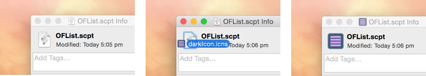
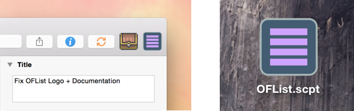

# OFList

Adapted from [Jason Verly's OmniFocus Due List Script](http://mygeekdaddy.net/2015/07/03/getting-my-daily-to-do-list-out-of-omnifocus/) exporting the flagged tasks to a daily to-do list (instead of by due date in the original script).

Create a daily to-do list from OmniFocus:

Output is a markdown (.md) file which can be easily converted to a PDF.

##Icons

 

 

To add an icon to the script right-click on the file and select "Get Info". Next drag and drop the selected icon onto the icon holder.

 
##Menubar

For easy access the script file can be added to the menubar within OmniFocus by placing the file in the script folder (Help > Open Script Folder). To add it right-click the toolbar and select "Customize Toolbar" then script should show up and be available to drag onto the toolbar.

The image above shows the icon for OFList on the toolbar, allowing for easy access.

-----------

Hope that you can find a use for it!

Matt

P.S - I'd love some feedback, open to feature requests too!
