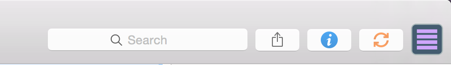

# OFList

Create a daily to-do list for OmniFocus:

Output is a markdown (.md) file which can be easily converted to a PDF.

Adapted from [Jason Verly's OmniFocus*_*Due*_*List.scpt](http://mygeekdaddy.net/2015/07/03/getting-my-daily-to-do-list-out-of-omnifocus/) to access the flagged tasks instead of by due date.
 
For easy access the toolbar within OmniFocus the script file can be added to the script folder (Help > Open Script Folder). To add to toolbar right-click and select "Customize Toolbar" then script should show up and available to drag to the toolbar.

The image above shows the icon for OFList on the toolbar, allowing for easy access.

Hope that you can find a use for it!

Matt

P.S - I'd love some feedback, open to feature requests too!